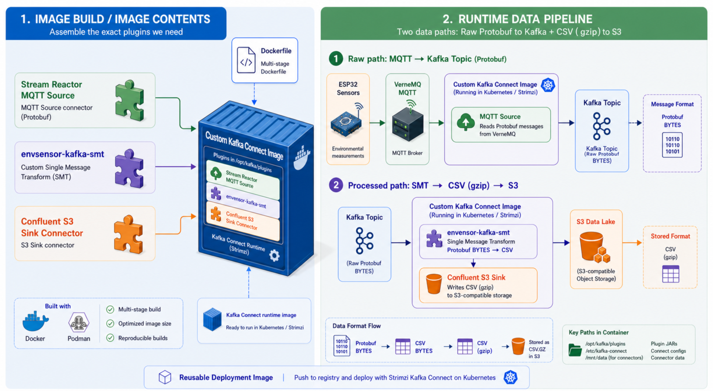

# kafka-connect-image

[https://github.com/pvamos/kafka-connect-image](https://github.com/pvamos/kafka-connect-image)

Custom Kafka Connect container image for the **envsensor** platform.

The image is based on the Strimzi Kafka Connect base image and adds the connector plugins needed by the environmental monitoring pipeline:

* **Lenses Stream Reactor MQTT Source connector**
* **Confluent Amazon S3 Sink Connector**
* **envsensor Kafka SMT plugin** built from `envsensor-kafka-smt`

`envsensor-kafka-smt` is published at: [https://github.com/pvamos/envsensor-kafka-smt](https://github.com/pvamos/envsensor-kafka-smt)



The image is intended to be used by a Strimzi-managed `KafkaConnect` cluster and `KafkaConnector` resources that:

1. read enriched MQTT/protobuf messages from VerneMQ,
2. write raw protobuf bytes into Kafka,
3. transform protobuf bytes into CSV row bytes with `envsensor-kafka-smt`,
4. write CSV/Zstandard files into S3-compatible object storage.

---

## 👨‍🔬 Author

**Péter Vámos**

* [https://github.com/pvamos](https://github.com/pvamos)
* [https://linkedin.com/in/pvamos](https://linkedin.com/in/pvamos)
* [pvamos@gmail.com](mailto:pvamos@gmail.com)

---

## 🎓 Academic context

This project is part of the infrastructure/software stack supporting the author's **2026 thesis project**
for the **Expert in Applied Environmental Studies BSc** program at **John Wesley Theological College, Budapest**.

The image is used in an environmental monitoring data pipeline built around ESP32 sensor nodes, VerneMQ MQTT, Kafka, Kafka Connect, S3-compatible object storage, ClickHouse and Grafana.

---

## 📜 Overview

The repository currently contains:

```text
.
├── Dockerfile
├── README.md
├── LICENSE
├── THIRD_PARTY_NOTICES.md
├── .gitignore
└── .github_token.template
```

The Dockerfile builds a custom Kafka Connect image in two stages:

1. **SMT build stage**
   * starts from `docker.io/library/maven:3.9.12-eclipse-temurin-17`
   * clones `envsensor-kafka-smt`
   * optionally uses a BuildKit/Podman secret named `github_token`
   * builds the SMT with Maven
   * copies the resulting shaded JAR to a stable path for the final image

2. **Kafka Connect runtime stage**
   * starts from `quay.io/strimzi/kafka:0.49.1-kafka-4.1.1`
   * installs tools needed to fetch and unpack connector archives
   * downloads the Stream Reactor MQTT connector
   * downloads the Confluent Amazon S3 Sink Connector
   * copies the built `envsensor-kafka-smt` JAR into the Kafka Connect plugin path
   * fixes ownership and permissions for the Kafka Connect runtime user

---

## 🧭 What the project does now

The current Dockerfile builds an image with this runtime base:

```text
quay.io/strimzi/kafka:0.49.1-kafka-4.1.1
```

It downloads and installs:

| Component | Version / source | Installed under |
|---|---|---|
| Strimzi Kafka Connect runtime | `quay.io/strimzi/kafka:0.49.1-kafka-4.1.1` | base image |
| `envsensor-kafka-smt` | `https://github.com/pvamos/envsensor-kafka-smt.git`, default ref `main` | `/opt/kafka/plugins/envsensor-smt` |
| Lenses Stream Reactor MQTT Source | `STREAM_REACTOR_VERSION=11.3.0` | `/opt/kafka/plugins/mqtt` |
| Confluent Amazon S3 Sink Connector | `CONFLUENT_S3_VERSION=12.0.0` | `/opt/kafka/plugins/confluentinc-kafka-connect-s3-12.0.0` |

The current Dockerfile copies the SMT JAR into:

```text
/opt/kafka/plugins/envsensor-smt/envsensor-smt.jar
```

That path still uses the older artifact/plugin directory name `envsensor-smt`, even though the public repository name is `envsensor-kafka-smt`.

This is operationally fine because Kafka Connect plugin discovery scans JARs under `/opt/kafka/plugins`. If you want naming consistency, rename the path in the Dockerfile to:

```text
/opt/kafka/plugins/envsensor-kafka-smt/envsensor-kafka-smt.jar
```

---

## 🧱 Image contents

The final Kafka Connect image contains:

```text
/opt/kafka/plugins/
├── mqtt/                                     # Stream Reactor MQTT connector
├── confluentinc-kafka-connect-s3-12.0.0/     # Confluent Amazon S3 Sink Connector
└── envsensor-smt/                            # envsensor Kafka SMT plugin
    └── envsensor-smt.jar
```

Expected plugin classes include:

```text
com.datamountaineer.streamreactor.connect.mqtt.source.MqttSourceConnector
io.confluent.connect.s3.S3SinkConnector
net.envsensor.kafka.connect.smt.EnvsensorProtobufToCsv$Value
```

The image is designed for this logical data flow:

```text
VerneMQ MQTT
  -> Stream Reactor MQTT Source connector
  -> Kafka topic containing protobuf bytes
  -> envsensor-kafka-smt
  -> CSV row bytes
  -> Confluent Amazon S3 Sink Connector
  -> S3-compatible object storage
```

### Confluent connector license note

The image downloads the **Amazon S3 Sink Connector for Confluent Platform** from Confluent Hub:

```text
https://docs.confluent.io/kafka-connectors/s3-sink/current/overview.html
```

The connector is distributed under the **Confluent Community License Version 1.0**:

```text
https://www.confluent.io/confluent-community-license/
```

That license allows access, modification and redistribution, but excludes making available a SaaS/PaaS/IaaS or similar online service that competes with Confluent products or services that provide the licensed software. It is source-available, not OSI-approved open source.

Your own Dockerfile, README and helper files in this repository can be MIT-licensed, but the final container image also contains third-party software under its own licenses.

---

## 📁 Repository layout

```text
kafka-connect-image/
|
├── Dockerfile                 # Multi-stage Kafka Connect image build
├── README.md                  # Project documentation
├── LICENSE                    # The MIT license
├── THIRD_PARTY_NOTICES.md     # Third-party software license notices
├── .gitignore                 # Local secrets/build artifact ignore rules
└── .github_token.template     # Placeholder template for optional private GitHub clone token
```

---

## ⚙️ Prerequisites

### Build machine

Required:

* Podman or Docker with BuildKit-compatible secret support
* network access to:
  * `docker.io`
  * `quay.io`
  * GitHub
  * Confluent Hub download endpoint
* access to your target image registry
* optional GitHub token only if the SMT repository/ref is private

Check tools:

```bash
podman --version
# or
docker --version
```

### Runtime cluster

The resulting image is intended for:

* Kubernetes
* Strimzi Kafka Operator
* a `KafkaConnect` custom resource
* a Kafka cluster reachable from the Connect worker pods
* a private image pull secret if the image is pushed to a private registry

---

## 🚀 Build and push

### Public-safe build example

```bash
IMAGE="registry.example.com/example/kafka-connect:0.0.0"

podman build   --format docker   --build-arg SMT_CACHEBUST="$(date +%s)"   --build-arg SMT_REPO="https://github.com/pvamos/envsensor-kafka-smt.git"   --build-arg SMT_REF="main"   -t "${IMAGE}"   .

podman push "${IMAGE}"
```

### Build with GitHub token secret

Only use this when the SMT repository or selected ref is private.

Create a local secret file:

```bash
cp .github_token.template .github_token
chmod 0600 .github_token
```

Edit `.github_token` and put the private token value in it.

Build:

```bash
IMAGE="registry.example.com/example/kafka-connect:0.0.0"

podman build   --format docker   --build-arg SMT_CACHEBUST="$(date +%s)"   --secret id=github_token,src=.github_token   --build-arg SMT_REPO="https://github.com/pvamos/envsensor-kafka-smt.git"   --build-arg SMT_REF="main"   -t "${IMAGE}"   .
```

Do **not** commit `.github_token`.

### Version overrides

The Dockerfile supports these build arguments:

| Build argument | Default | Purpose |
|---|---|---|
| `SMT_REPO` | `https://github.com/pvamos/envsensor-kafka-smt.git` | Git repository containing the SMT Maven project |
| `SMT_REF` | `main` | branch, tag or commit to build |
| `SMT_SUBDIR` | `.` | Maven project subdirectory |
| `SMT_MVN_ARGS` | `-DskipTests package` | Maven build arguments |
| `SMT_JAR_GLOB` | `target/*-all.jar` | shaded JAR glob |
| `SMT_CACHEBUST` | `0` | cache-buster for the Git clone layer |
| `STREAM_REACTOR_VERSION` | `11.3.0` | Stream Reactor release version |
| `CONFLUENT_S3_VERSION` | `12.0.0` | Confluent Amazon S3 Sink Connector version |
| `CONFLUENT_S3_URL` | derived from version | connector ZIP download URL |

Example:

```bash
podman build   --format docker   --build-arg SMT_REF="v0.1.0"   --build-arg STREAM_REACTOR_VERSION="11.3.0"   --build-arg CONFLUENT_S3_VERSION="12.0.0"   -t registry.example.com/example/kafka-connect:0.1.0   .
```

---

## 🔌 Use with Strimzi KafkaConnect

In the `kafka-connect` Helm values or Strimzi `KafkaConnect` resource, set the image to the image built from this repository:

```yaml
connect:
  image: "registry.example.com/example/kafka-connect:0.0.0"
  replicas: 3
  version: 4.1.1
  imagePullSecrets:
    - name: example-registry-pull-secret
```

Representative Strimzi `KafkaConnect` fragment:

```yaml
apiVersion: kafka.strimzi.io/v1beta2
kind: KafkaConnect
metadata:
  name: example-connect
  namespace: kafka
  annotations:
    strimzi.io/use-connector-resources: "true"
spec:
  version: "4.1.1"
  replicas: 3
  bootstrapServers: "example-kafka-bootstrap.kafka.svc.cluster.local:9092"

  image: "registry.example.com/example/kafka-connect:0.0.0"

  authentication:
    type: scram-sha-512
    username: connect
    passwordSecret:
      secretName: connect
      password: password

  config:
    group.id: "example-connect"
    offset.storage.topic: "example-connect-offsets"
    config.storage.topic: "example-connect-configs"
    status.storage.topic: "example-connect-status"
    offset.storage.replication.factor: 3
    config.storage.replication.factor: 3
    status.storage.replication.factor: 3
    key.converter: "org.apache.kafka.connect.storage.StringConverter"
    value.converter: "org.apache.kafka.connect.converters.ByteArrayConverter"
```

---

## 🧩 Example connector usage

### MQTT Source connector

Example public-safe MQTT source connector:

```yaml
apiVersion: kafka.strimzi.io/v1beta2
kind: KafkaConnector
metadata:
  name: mqtt-enriched-sensors-source
  namespace: kafka
  labels:
    strimzi.io/cluster: example-connect
spec:
  class: com.datamountaineer.streamreactor.connect.mqtt.source.MqttSourceConnector
  tasksMax: 1
  autoRestart:
    enabled: true
    maxRestarts: 10
  config:
    connect.mqtt.hosts: "tcp://vernemq-internal.vernemq.svc.cluster.local:1883"
    connect.mqtt.client.id: "example-connect-mqtt-enriched-1"
    connect.mqtt.username: "kafka-connect"
    connect.mqtt.password: "${env:MQTT_PASSWORD}"
    connect.mqtt.service.quality: "1"
    connect.mqtt.clean: "true"
    connect.mqtt.kcql: >
      INSERT INTO example-sensor-topic
      SELECT * FROM envsensor-enriched/#
      WITHCONVERTER=`io.lenses.streamreactor.connect.converters.source.BytesConverter`

    key.converter: "org.apache.kafka.connect.storage.StringConverter"
    value.converter: "org.apache.kafka.connect.converters.ByteArrayConverter"
```

### S3 sink with SMT

Example public-safe S3 sink connector:

```yaml
apiVersion: kafka.strimzi.io/v1beta2
kind: KafkaConnector
metadata:
  name: envsensor-s3-readings-csv-zst-sink
  namespace: kafka
  labels:
    strimzi.io/cluster: example-connect
spec:
  class: io.confluent.connect.s3.S3SinkConnector
  tasksMax: 3
  config:
    topics: "example-sensor-topic"

    key.converter: "org.apache.kafka.connect.storage.StringConverter"
    value.converter: "org.apache.kafka.connect.converters.ByteArrayConverter"

    transforms: "EncodeCsv"
    transforms.EncodeCsv.type: "net.envsensor.kafka.connect.smt.EnvsensorProtobufToCsv$Value"
    transforms.EncodeCsv.on.error: "fail"
    transforms.EncodeCsv.csv.delimiter: ","
    transforms.EncodeCsv.csv.sanitize.newlines: "true"
    transforms.EncodeCsv.require.bytes: "true"

    s3.bucket.name: "example-lake"
    s3.region: "example-region"
    store.url: "https://s3.example.com"

    aws.access.key.id: "${env:AWS_ACCESS_KEY_ID}"
    aws.secret.access.key: "${env:AWS_SECRET_ACCESS_KEY}"

    format.class: "io.confluent.connect.s3.format.bytearray.ByteArrayFormat"
    storage.class: "io.confluent.connect.s3.storage.S3Storage"
    partitioner.class: "io.confluent.connect.storage.partitioner.TimeBasedPartitioner"
    path.format: "'readings/dt='YYYY-MM-dd'/h='HH"
    locale: "en"
    timezone: "UTC"
    timestamp.extractor: "Record"

    flush.size: 1000
```

Adapt connector settings to the exact S3 connector and object layout you use.

---

## 🧰 Replace placeholders before use

Before using this repository in a real deployment, replace placeholder values with your own deployment values.

There are two supported workflows.

---

### 1️⃣ Edit placeholder files directly in a private clone

Use this workflow if you cloned the repository for your own deployment and do **not** plan to push your modified files back to a public remote.

#### Step 1: choose the target image name

Replace:

```bash
IMAGE="registry.example.com/example/kafka-connect:0.0.0"
```

with your real registry and tag:

```bash
IMAGE="<your-registry>/<your-project>/kafka-connect:<your-tag>"
```

#### Step 2: configure SMT source

For the public SMT repository:

```bash
--build-arg SMT_REPO="https://github.com/pvamos/envsensor-kafka-smt.git"
--build-arg SMT_REF="main"
```

For a private branch/tag/commit:

```bash
--build-arg SMT_REPO="<your-private-smt-repo-url>"
--build-arg SMT_REF="<your-branch-tag-or-commit>"
```

Use a GitHub token secret only when required:

```bash
podman build   --secret id=github_token,src=.github_token   --build-arg SMT_REPO="<your-private-smt-repo-url>"   --build-arg SMT_REF="<your-ref>"   -t "${IMAGE}"   .
```

#### Step 3: optionally update connector versions

Edit or override:

```bash
--build-arg STREAM_REACTOR_VERSION="11.3.0"
--build-arg CONFLUENT_S3_VERSION="12.0.0"
```

Use versions compatible with your Kafka Connect runtime.

#### Step 4: build and push

```bash
podman build   --format docker   --build-arg SMT_CACHEBUST="$(date +%s)"   --build-arg SMT_REPO="https://github.com/pvamos/envsensor-kafka-smt.git"   --build-arg SMT_REF="main"   -t "${IMAGE}"   .

podman push "${IMAGE}"
```

#### Step 5: update Strimzi/Helm values

In your Kafka Connect Helm values or Strimzi manifest:

```yaml
connect:
  image: "<your-registry>/<your-project>/kafka-connect:<your-tag>"
  imagePullSecrets:
    - name: <your-image-pull-secret>
```

Create the pull secret if required:

```bash
kubectl -n kafka create secret docker-registry <your-image-pull-secret>   --docker-server=<your-registry>   --docker-username=<your-registry-username>   --docker-password=<your-registry-token>   --docker-email=<your-email>
```

---

### 2️⃣ Keep public files unchanged and use private build/deployment files

Use this workflow if you want to keep the Git checkout clean and avoid accidentally committing private values.

Recommended layout:

```text
projects/
├── kafka-connect-image/              # public Git repository
└── private-kafka-connect-image/      # not committed
    ├── build.env
    ├── github_token
    └── kafka-connect.private.yaml
```

#### Step 1: create a private build environment

Create:

```text
../private-kafka-connect-image/build.env
```

Example:

```bash
export IMAGE='<your-registry>/<your-project>/kafka-connect:<your-tag>'
export SMT_REPO='https://github.com/pvamos/envsensor-kafka-smt.git'
export SMT_REF='main'
export STREAM_REACTOR_VERSION='11.3.0'
export CONFLUENT_S3_VERSION='12.0.0'
```

Load it:

```bash
set -a
. ../private-kafka-connect-image/build.env
set +a
```

#### Step 2: build with private values

```bash
podman build   --format docker   --build-arg SMT_CACHEBUST="$(date +%s)"   --build-arg SMT_REPO="${SMT_REPO}"   --build-arg SMT_REF="${SMT_REF}"   --build-arg STREAM_REACTOR_VERSION="${STREAM_REACTOR_VERSION}"   --build-arg CONFLUENT_S3_VERSION="${CONFLUENT_S3_VERSION}"   -t "${IMAGE}"   .
```

If a private GitHub token is required:

```bash
podman build   --format docker   --build-arg SMT_CACHEBUST="$(date +%s)"   --secret id=github_token,src=../private-kafka-connect-image/github_token   --build-arg SMT_REPO="${SMT_REPO}"   --build-arg SMT_REF="${SMT_REF}"   --build-arg STREAM_REACTOR_VERSION="${STREAM_REACTOR_VERSION}"   --build-arg CONFLUENT_S3_VERSION="${CONFLUENT_S3_VERSION}"   -t "${IMAGE}"   .
```

Push:

```bash
podman push "${IMAGE}"
```

#### Step 3: keep private deployment values outside this repository

Example private Helm values:

```yaml
connect:
  image: "<your-registry>/<your-project>/kafka-connect:<your-tag>"
  imagePullSecrets:
    - name: <your-image-pull-secret>
```

Example private connector values:

```yaml
mqtt:
  password: "<your-mqtt-password>"

s3:
  endpoint: "<your-s3-endpoint>"
  bucket: "<your-s3-bucket>"
  region: "<your-s3-region>"
```

Create real secrets in Kubernetes, not in this repository:

```bash
kubectl -n kafka create secret generic kafka-connect-runtime-secrets   --from-literal=MQTT_PASSWORD='<your-mqtt-password>'   --from-literal=AWS_ACCESS_KEY_ID='<your-access-key-id>'   --from-literal=AWS_SECRET_ACCESS_KEY='<your-secret-access-key>'
```

#### Step 4: keep private files ignored

Recommended local ignore patterns:

```gitignore
private/
secrets/
*.private.yaml
*.private.yml
*.local.yaml
*.local.yml
.env
.env.*
.github_token
github_token
*_token
*token*
*.kubeconfig
```

Before committing changes to the public repo:

```bash
git status
git diff --cached
```

---

## 🔎 Verify plugin loading

After deploying a Kafka Connect cluster using the image:

```bash
kubectl -n kafka get pods -l strimzi.io/kind=KafkaConnect
```

Inspect plugin files:

```bash
kubectl -n kafka exec -it <connect-pod> --   find /opt/kafka/plugins -maxdepth 3 -type f -name '*.jar' | sort
```

Check for SMT JAR:

```bash
kubectl -n kafka exec -it <connect-pod> --   find /opt/kafka/plugins -maxdepth 4 -type f -name '*envsensor*jar' -print
```

Check worker logs:

```bash
kubectl -n kafka logs <connect-pod> --tail=200
```

---

## ⚠️ Operational cautions

* Keep the Strimzi image tag aligned with the Strimzi/Kafka version used by your cluster.
* Plugin compatibility matters: connector versions should be compatible with the Kafka Connect runtime.
* Do not bake runtime secrets into the image.
* Do not commit `.github_token`.
* Do not publish private image registry names if they reveal internal infrastructure.
* Rebuild and redeploy the image whenever connector versions or the SMT ref changes.
* Kafka Connect must be restarted or rolled after changing the image/plugin contents.

---

## 🔬 Troubleshooting

### Build cannot clone the SMT repository

If the repo is public, build without the token secret:

```bash
podman build   --build-arg SMT_REPO="https://github.com/pvamos/envsensor-kafka-smt.git"   --build-arg SMT_REF="main"   -t registry.example.com/example/kafka-connect:0.0.0   .
```

If the repo/ref is private, provide a token:

```bash
podman build   --secret id=github_token,src=.github_token   --build-arg SMT_REPO="<private-repo-url>"   --build-arg SMT_REF="<private-ref>"   -t registry.example.com/example/kafka-connect:0.0.0   .
```

### Build cannot download connector archives

Check network access and version values:

```bash
podman build   --build-arg STREAM_REACTOR_VERSION="11.3.0"   --build-arg CONFLUENT_S3_VERSION="12.0.0"   -t registry.example.com/example/kafka-connect:0.0.0   .
```

### Kafka Connect cannot find the SMT

Check inside a pod:

```bash
kubectl -n kafka exec -it <connect-pod> --   find /opt/kafka/plugins -maxdepth 4 -type f -name '*envsensor*jar' -print
```

Expected current path:

```text
/opt/kafka/plugins/envsensor-smt/envsensor-smt.jar
```

### Kafka Connect cannot find the MQTT Source connector

```bash
kubectl -n kafka exec -it <connect-pod> --   find /opt/kafka/plugins/mqtt -type f -name '*.jar' | head
```

Check the connector class:

```text
com.datamountaineer.streamreactor.connect.mqtt.source.MqttSourceConnector
```

### Kafka Connect cannot find the S3 Sink connector

```bash
kubectl -n kafka exec -it <connect-pod> --   find /opt/kafka/plugins -path '*confluentinc-kafka-connect-s3*' -type f -name '*.jar' | head
```

Check the connector class:

```text
io.confluent.connect.s3.S3SinkConnector
```

### Image pull fails in Kubernetes

Check image pull secret:

```bash
kubectl -n kafka get secret <your-image-pull-secret>
kubectl -n kafka describe pod <connect-pod>
```

---

## 🧭 Roadmap / recommended improvements

* Rename SMT plugin directory from `envsensor-smt` to `envsensor-kafka-smt` for consistency with the public repository.
* Add a `Makefile` for common build/push commands.
* Add a public `build.env.example`.
* Add a `THIRD_PARTY_NOTICES.md` file for image contents.
* Add CI to build the image with public placeholder values.
* Pin connector checksums for downloaded release archives.
* Add `ARG` values for Strimzi base image version.
* Add an image label block with source, revision and license metadata.

---

## ⚖️ License

This repository is intended to be published under the **MIT License** for the project-owned files.

The final container image includes third-party software from the Strimzi Kafka base image and connector/plugin downloads. Those third-party components remain under their own licenses.

When publishing or redistributing the image, include appropriate third-party license notices for:

* Strimzi Kafka base image
* Apache Kafka / Kafka Connect runtime
* Stream Reactor MQTT connector
* Confluent Amazon S3 Sink Connector
* envsensor-kafka-smt
* operating-system packages installed in the image

Recommended files:

```text
LICENSE
THIRD_PARTY_NOTICES.md
```

### MIT License

MIT License

Copyright (c) 2025 Péter Vámos pvamos@gmail.com https://github.com/pvamos

Permission is hereby granted, free of charge, to any person obtaining a copy
of this software and associated documentation files (the "Software"), to deal
in the Software without restriction, including without limitation the rights
to use, copy, modify, merge, publish, distribute, sublicense, and/or sell
copies of the Software, and to permit persons to whom the Software is
furnished to do so, subject to the following conditions:

The above copyright notice and this permission notice shall be included in all
copies or substantial portions of the Software.

THE SOFTWARE IS PROVIDED "AS IS", WITHOUT WARRANTY OF ANY KIND, EXPRESS OR
IMPLIED, INCLUDING BUT NOT LIMITED TO THE WARRANTIES OF MERCHANTABILITY,
FITNESS FOR A PARTICULAR PURPOSE AND NONINFRINGEMENT. IN NO EVENT SHALL THE
AUTHORS OR COPYRIGHT HOLDERS BE LIABLE FOR ANY CLAIM, DAMAGES OR OTHER
LIABILITY, WHETHER IN AN ACTION OF CONTRACT, TORT OR OTHERWISE, ARISING FROM,
OUT OF OR IN CONNECTION WITH THE SOFTWARE OR THE USE OR OTHER DEALINGS IN THE
SOFTWARE.
